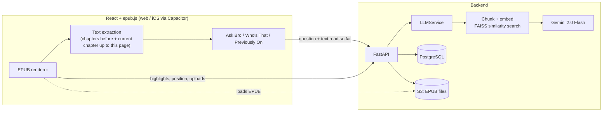

# BookBro

An EPUB reader with a built-in AI companion that only knows what you've read so far, so it can answer questions about the book without spoiling it.

## What it does

- **Ask Bro**: chat about the book ("why did she do that?", "who's on whose side?"). Answers come from the pages you've read, never from what's ahead.
- **Who's That**: highlight a name, place, object, event, or group and get a short spoiler-free explainer, similar to Kindle X-Ray but for any EPUB.
- **Previously On**: a recap of the last chapter and the current one up to your page, shown when you open a book.
- **Roleplay**: step into a recent scene and chat in character with someone from the book, based on the pages you just read.
- **A full reader**: upload EPUBs, table of contents, full-text search, highlights, saved reading position, and display settings (font size, line spacing, alignment, background). Runs on the web and on iOS through Capacitor.

## Screenshots

*Screenshots use Fourth Wing (spoilers).*

<p>


</p>

## Tech stack

- **Frontend:** React 19, React Router, epub.js, Capacitor 7 (iOS)
- **Backend:** Python, FastAPI, SQLAlchemy, Pydantic
- **AI:** Google Gemini 2.0 Flash, LangChain (prompt templates, text splitting), FAISS, Hugging Face sentence-transformer embeddings
- **Data:** PostgreSQL (books, covers, highlights, reading position), AWS S3 (EPUB files)

## Architecture

The React app renders the EPUB with epub.js and talks to a FastAPI backend over REST. Books are uploaded once: the file goes to S3, and metadata plus the cover image go to Postgres. When you use an AI feature, the client pulls the text you've already read out of the book and sends it with the request. The backend chunks and embeds that text, retrieves the relevant passages, and prompts Gemini.



### Key design decisions

- **Spoiler-free by construction.** The client builds context from the epub.js spine and the current CFI: every chapter before the current one, the current chapter up to the start of the visible page, and the visible page itself (`frontend/src/services/Extract*.js`). Text past your position is never sent, so the model can't leak it, regardless of how it's prompted.
- **Retrieval over the read text.** Whole books don't fit well in a prompt, so `LLMService` splits the context into 5,000-character chunks, embeds them, and runs a FAISS top-5 search. For Ask Bro, the retrieved chunks are re-sorted by position so they read in story order, and the most recent pages (previous chapter through the current page) are always included, since most questions are about what just happened.
- **Two-step lookup.** Who's That first classifies the highlighted phrase as a character, place, event, object, or group (or nothing worth explaining). It then asks Gemini for a type-specific JSON profile (for example, relationships and personality for a character) and turns that JSON into a short paragraph. Retrieval only keeps chunks that actually contain the phrase, and falls back to a 10,000-character window around its first mention.
- **Roleplay grounded in recent pages.** Roleplay first generates scenes from the pages you just read, then builds a profile of the character with voice samples, and uses both to keep the in-character chat consistent with the book so far.

## Project structure

```
backend/
  main.py                 FastAPI app, CORS, creates DB tables
  api_routes.py           REST endpoints (/api/...)
  services/llm_service.py Retrieval + Gemini calls for every AI feature
  prompt_templates/       Prompts for recap, lookup, Ask Bro, roleplay
  database/               SQLAlchemy models and managers (books, highlights)
  file_storage/           S3 upload for EPUB files
  models/                 Pydantic request schemas
frontend/
  src/pages/              Home (library) and EpubViewer
  src/components/         Library UI, reader, feature panels
  src/services/           Extracts read-so-far text from the EPUB
  src/api/                Fetch wrappers for the backend
  ios/                    Capacitor iOS project
```

## Getting started

Requires Python 3.11+, Node.js, a PostgreSQL database, an S3 bucket, and a Gemini API key. AWS credentials are read by boto3 from your usual AWS config or environment.

### Backend

```bash
cd backend
python -m venv venv
source venv/bin/activate
pip install -r requirements.txt
```

Create `backend/consts/` (gitignored) with three files:

| File | Variables |
| --- | --- |
| `api_keys.py` | `APIKEY` (Gemini) |
| `db_keys.py` | `HOST`, `DBNAME`, `USERNAME`, `PASSWORD` |
| `s3_keys.py` | `BUCKETNAME` |

Tables are created on startup.

```bash
python -m uvicorn main:app --host 0.0.0.0 --port 5000 --reload
```

### Frontend

Create `frontend/src/consts/consts.js` (gitignored):

```js
export const IPADDRESS = 'localhost';  // backend host; port 5000 is assumed
export const AWS_S3_URI_BASE = 'https://<bucket>.s3.<region>.amazonaws.com/';
```

```bash
cd frontend
npm install
npm start
```

### iOS (optional)

`frontend/capacitor.config.ts` points the app at a dev server URL; change it to your machine's address first.

```bash
cd frontend
npm run build
npx cap sync ios
npx cap open ios
```
